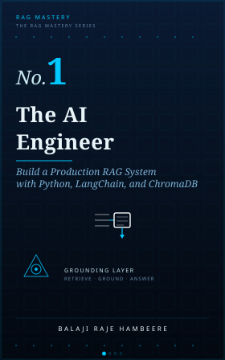
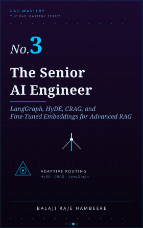
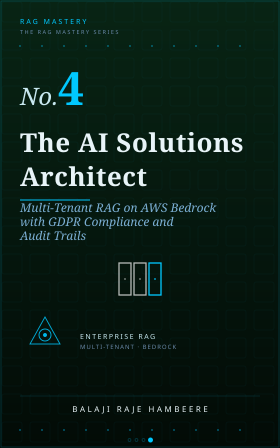

<div align="center">



# The AI Engineer — Production RAG Chatbot in Python (LangChain + ChromaDB + FastAPI)

**ShopBot**: an open-source, production-grade Retrieval-Augmented Generation (RAG) chatbot built end-to-end in Python — the complete companion codebase for *The AI Engineer*, Book 1 of the [Zudyog RAG Mastery Series](https://www.zudyog.com/).

### 📖 Every line of this code is explained, chapter by chapter, in the book — and Book 1 is 100% free.

[](https://www.zudyog.com/books/the-ai-engineer)

This repo shows you *what* was built. The book shows you *why* — every design decision, every dead end, every real evaluation score, written as the ten chapters that produced this exact code.

[](https://www.python.org/)
[](https://fastapi.tiangolo.com/)
[](https://www.langchain.com/)
[](https://www.trychroma.com/)
[](https://github.com/explodinggradients/ragas)
[](https://mlflow.org/)
[](https://nextjs.org/)

📖 [Read the book](https://www.zudyog.com/books/the-ai-engineer) · 🌐 [zudyog.com](https://www.zudyog.com/) · 🐛 [Report an issue](https://github.com/zudyog/the-ai-engineer/issues) · ⭐ Star this repo if it helped you

</div>

---

## What this is

This repository is the real, working codebase behind **ShopBot** — a Retrieval-Augmented Generation (RAG) product assistant built for **zUdyog Fashion**, a fictional e-commerce storefront used throughout the book to teach production RAG engineering with real code, not toy examples.

Every file in `shopbot/` is built chapter-by-chapter in *The AI Engineer* and answers customer questions **only from retrieved evidence** — product catalog data embedded and stored in a vector database — instead of guessing from an LLM's training memory. This architecture, called the **Grounding Layer** (or the **Pramana Framework** in the book), is the core discipline the book teaches: how to stop an LLM from confidently hallucinating answers, and how to prove — with real evaluation scores, not vibes — that it has stopped.

If you're searching for **how to build a RAG chatbot in Python**, a **LangChain + ChromaDB tutorial**, a **FastAPI RAG backend example**, or a working **RAGAS faithfulness and context precision evaluation script**, this repository is a complete, runnable reference implementation.

## Why this project exists

Most RAG tutorials stop at "embed some text, query a vector store, print an answer." This project goes further, because that's where real systems actually break:

- **Confident Drift** — the failure mode where an LLM answers fluently and wrong because nothing stopped it from guessing. Chapter 1 diagnoses it; every chapter after exists to prevent it.
- **Grounded retrieval, not blind generation** — every answer is constrained to what ChromaDB actually retrieves above a calibrated similarity threshold (`0.75`).
- **Honest refusal over hallucination** — when the catalog has no answer, ShopBot says so and routes to `support@zudyog.com`, rather than inventing a product feature that doesn't exist.
- **Measured, not assumed, quality** — a real RAGAS evaluation harness scores Faithfulness and Context Precision against a labelled 20-question test set, logged to MLflow so the trend is visible run over run.
- **Actually deployable** — Pydantic input validation, a FastAPI lifespan-managed chain, a `Procfile` for Railway, and a Next.js storefront with a live chat widget.

## Architecture

```
zudyog-fashion/   ← Next.js storefront + AI chat widget       (port 3000)
shopbot/          ← FastAPI RAG backend (retriever + LLM)     (port 8000)
```

```
Customer question
      │
      ▼
FastAPI  /ask  (Pydantic-validated input)
      │
      ▼
Embed query → text-embedding-3-small (1,536-dim vector)
      │
      ▼
ChromaDB similarity search  (0.75 threshold, top 3 chunks)
      │
      ├── nothing above threshold → honest fallback → support@zudyog.com
      │
      ▼
Grounded prompt (context + question) → gpt-4o-mini @ temperature 0
      │
      ▼
Answer — traced to MLflow, scored by RAGAS
```

## Tech stack

| Layer | Technology |
| --- | --- |
| Backend API | Python, FastAPI, Pydantic, Uvicorn |
| RAG orchestration | LangChain |
| Vector database | ChromaDB (HNSW, cosine similarity) |
| Embeddings & LLM | OpenAI `text-embedding-3-small`, `gpt-4o-mini` |
| Evaluation | RAGAS (Faithfulness, Context Precision) |
| Experiment tracking | MLflow (PostgreSQL + Docker Compose) |
| Frontend | Next.js, React, Tailwind CSS, `react-markdown` |
| Deployment | Railway (backend), Vercel (frontend) |

## Quickstart

```bash
# Backend
cd shopbot
python -m venv venv && source venv/bin/activate
pip install -r requirements.txt
cp .env.example .env               # add your OPENAI_API_KEY
python -m src.ingest                # embed the catalog into ChromaDB
python -m src.api                   # → http://localhost:8000/docs

# Frontend (separate terminal)
cd shopbot/zudyog-fashion
npm install && npm run dev          # → http://localhost:3000
```

Full setup, evaluation, MLflow tracing, deployment, and a 6-step manual test plan mapped to book chapters: **[shopbot/README.md](shopbot/README.md)**.

## What each chapter builds

| Chapter | Title | What it builds in this repo |
| --- | --- | --- |
| 1 | The Problem With Brilliant Liars | Diagnoses Confident Drift — the failure this whole codebase exists to prevent |
| 2 | Before the First Line | Project setup, `.env`, the zUdyog Fashion product catalog |
| 3 | What 1,536 Numbers Actually Mean | `text-embedding-3-small`, cosine similarity fundamentals |
| 4 | The Memory That Thinks | `src/ingest.py` — ChromaDB vector store setup |
| 5 | Cut It Right | Chunking strategy for product attributes |
| 6 | The Right Answer Is Already There | `src/retriever.py` — the 0.75 similarity threshold |
| 7 | The Prompt Is the Product | `src/prompt.py` — the grounded, temperature-0 system prompt |
| 8 | Give It a Door | `src/api.py` — FastAPI, Pydantic validation, MLflow tracing, Railway deploy |
| 9 | Four Questions Is Not a Test | `evaluation/evaluate.py` — RAGAS scoring + MLflow experiment tracking |
| 10 | Ship It | Full pipeline live, beta-tested, and shipped end to end |

## Repository structure

```
the-ai-engineer/
└── shopbot/
    ├── src/               # retriever, prompt, chain, API
    ├── data/               # zUdyog Fashion product catalog
    ├── evaluation/         # RAGAS test cases + evaluation harness
    ├── zudyog-fashion/      # Next.js storefront + chat widget
    ├── docker-compose.yml  # MLflow + PostgreSQL
    ├── Procfile             # Railway deployment
    └── README.md            # full setup, testing, and deployment guide
```

## Who this is for

Developers, ML engineers, and technical founders learning to build **production RAG systems** — not another prototype that hallucinates in front of a customer. If you're evaluating **LangChain vs. plain OpenAI SDK**, **ChromaDB vs. Pinecone vs. Qdrant**, or how to actually **evaluate a RAG pipeline with RAGAS**, the working code and the book's reasoning behind every decision are both here.

## Related

This is Book 1 of the RAG Mastery series. Book 2, *The Applied AI Engineer*, continues this exact codebase with hybrid BM25 + dense retrieval, cross-encoder re-ranking, and Redis conversation memory — closing the vocabulary-gap and precision failures this book's evaluation surfaces.

## Where the story goes next

You've read the code. ShopBot works. Chapter 9's evaluation proved it — Faithfulness and Context Precision, measured, not assumed. That feeling, the first time a number confirms what you built actually holds — that's the moment each of these next three books starts from, and each one takes it somewhere the last chapter of this repo doesn't reach yet.

<table>
<tr>
<td width="140" valign="top">

</td>
<td valign="top">

### Book 2 — [The Applied AI Engineer](https://www.zudyog.com/books/the-applied-ai-engineer)
**Hybrid Search, BM25 Reranking, and Production RAG with Qdrant and RAGAS**

Chapter 9 of this book already told you the truth: Context Precision dropped once the catalog scaled past five products. That's not a footnote — it's the next three months of someone's actual customers getting the wrong answer. Book 2 is where you stop tolerating that number and go fix it. Hybrid BM25 + dense retrieval closes the vocabulary gap. Cross-encoder re-ranking sorts out what cosine similarity alone can't. Redis conversation memory means a customer never has to repeat themselves. If Book 1 proved the architecture works, Book 2 is where it starts working *well enough to trust with real traffic*.

</td>
</tr>
<tr>
<td width="140" valign="top">

</td>
<td valign="top">

### Book 3 — [The Senior AI Engineer](https://www.zudyog.com/books/the-senior-ai-engineer)
**LangGraph, HyDE, CRAG, and Fine-Tuned Embeddings for Advanced RAG**

Every RAG system eventually meets its hard 9% — the ambiguous question, the query that needs two hops of reasoning, the retrieval that looked fine and was quietly wrong. That's the gap between a system you demo and a system you'd stake your name on. Book 3 is nine chapters on closing it: adaptive routing with LangGraph, HyDE for queries that don't match the vocabulary of your documents, Corrective RAG for catching retrieval failures before they become answers, and embedding models fine-tuned on your own domain instead of borrowed from someone else's. This is the book for the engineer who's done shipping "good enough."

</td>
</tr>
<tr>
<td width="140" valign="top">

</td>
<td valign="top">

### Book 4 — [The AI Solutions Architect](https://www.zudyog.com/books/the-ai-solutions-architect)
**Multi-Tenant RAG on AWS Bedrock with GDPR Compliance and Audit Trails**

There's a specific moment every founder building this hits: the first enterprise customer asks "can you guarantee my data never touches another tenant's index, and can you prove it in an audit?" Book 1 built the Grounding Layer for one store. Book 4 builds it for every tenant you'll ever sign — per-tenant Qdrant collections, AWS Bedrock at scale, and GDPR-compliant deletion pipelines that hold up when someone actually asks you to produce the receipt. The Pramana Framework you've been building since Chapter 1 of Book 1, taken all the way to the architecture that lets you say yes to that question without flinching.

</td>
</tr>
</table>

**[Book 1 is free.](https://www.zudyog.com/books/the-ai-engineer)** You already have the hardest part — a working system and the discipline to measure it honestly. Books 2 through 4 are where that discipline gets tested against real traffic, real ambiguity, and real customers who will hold you to it. [See the full series →](https://www.zudyog.com/)

## About Zudyog

[**Zudyog**](https://www.zudyog.com/) publishes the **RAG Mastery Series** — 11 books on building production Retrieval-Augmented Generation systems, from first embeddings to cloud-native, multi-tenant agentic architectures. Four core books are available now (this one included); seven companion books release quarterly starting November 2026.

**Book 1 — *The AI Engineer* — the book behind this repository — is completely free to read** at [zudyog.com/books/the-ai-engineer](https://www.zudyog.com/books/the-ai-engineer). A subscription unlocks the full series, including Book 2's hybrid search and re-ranking upgrade to this exact codebase.

Every book in the series follows the same principle this repository demonstrates: real, runnable code and measured evaluation scores, not diagrams of an architecture that was never actually built.

## Contributing

Issues and pull requests are welcome — this is a living reference implementation, and reports of bugs, version mismatches, or unclear steps in the setup are genuinely useful. New to the codebase? **[CONTRIBUTING.md](CONTRIBUTING.md)** has a list of good-first-issue-sized gaps to start from.
